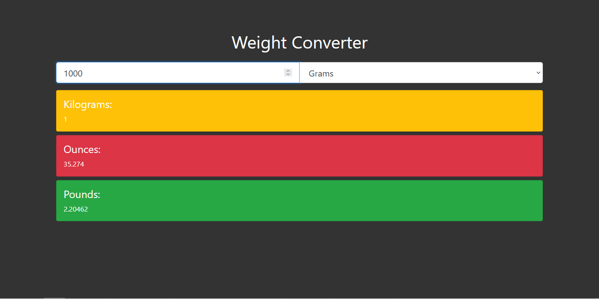

# Weight Converter

<h1 align="center">
    
</h1>

A simple weight converter, expanded and improved from the original by [Traversy Media](https://www.youtube.com/watch?v=7l-ZAuU8TXc).

## Running the Project:
- Simply open index.html on your browser;
- Choose from grams, kilograms, ounces and pounds;
- Input some number to get the conversion to the other three systems; 

## Technologies used:
* HTML5/CSS3
* Vanilla JS (ES6)
* Bootstrap 4
